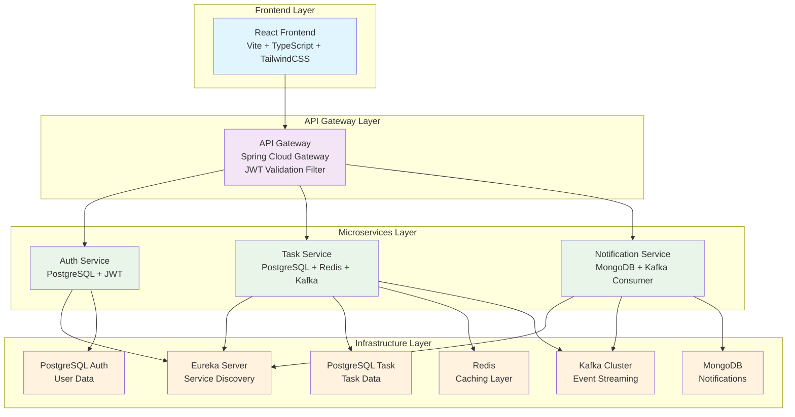
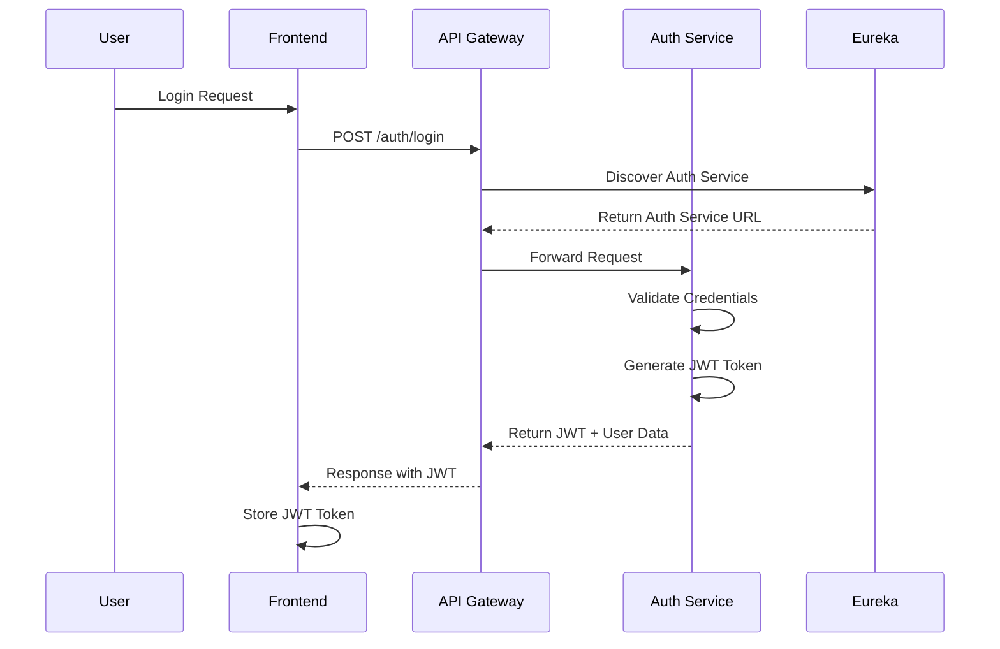
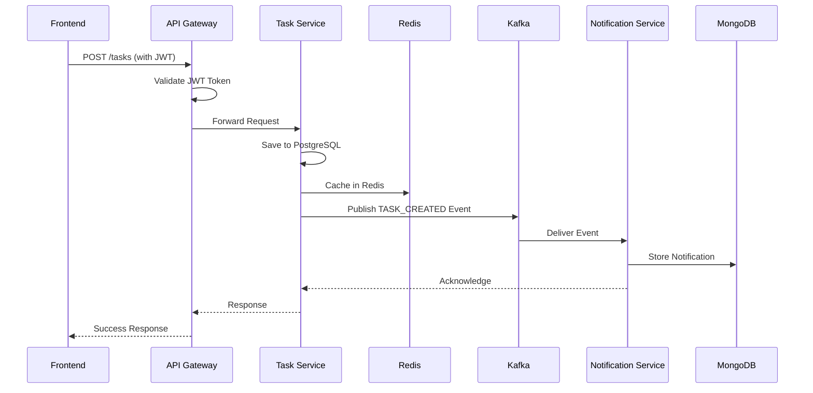

# TaskPRO 🚀

> A **production-grade microservices task management system** demonstrating enterprise-level architecture patterns and modern engineering practices.


---

## 🎯 Project Overview

**TaskPRO** is a comprehensive microservices-based task management application designed to showcase **production-level architecture** with modern engineering practices. This project demonstrates how enterprise applications are built using industry-standard technologies and patterns.

### Why This Project Exists

This is **NOT** just another todo app. It's an **engineering learning platform** designed to:

- **Demonstrate Microservices Architecture**: Real-world service separation with proper communication patterns
- **Showcase Production Tools**: Service discovery, API gateway, event streaming, caching, monitoring
- **Interview Preparation**: Solid talking points for system design and architecture discussions
- **Learning Best Practices**: Clean code, proper separation of concerns, enterprise patterns

> **Business Logic**: Intentionally simple (task management)  
> **Engineering Depth**: Intentionally comprehensive (enterprise-grade patterns)

---

## 🏗️ System Architecture



---

## 📦 Project Structure

```
taskpro/
├── backend/
│   ├── pom.xml                        # Parent Maven configuration
│   ├── eureka-server/                 # Service discovery server
│   ├── api-gateway/                   # Central entry point + JWT filter
│   ├── auth-service/                  # Authentication & user management
│   ├── task-service/                  # Core business logic + caching + events
│   └── notification-service/          # Event-driven notifications
├── frontend/
│   └── taskflow-frontend/             # React 19 + TypeScript + Vite
├── docker/
│   └── prometheus/
│       └── prometheus.yml             # Monitoring configuration
├── .github/
│   └── workflows/
│       └── ci.yml                     # CI/CD pipeline
├── docker-compose.yml                 # Complete infrastructure setup
└── README.md                          # This file
```

---

## 🔧 Technology Stack

### Backend Technologies

| Layer | Technology | Purpose |
|---|---|---|
| **Language** | Java 21 | Modern Java with latest features |
| **Framework** | Spring Boot 3.2.4 | Enterprise application framework |
| **Microservices** | Spring Cloud 2023.0.1 | Service mesh components |
| **API Gateway** | Spring Cloud Gateway | Central routing + security |
| **Service Discovery** | Eureka Server | Dynamic service registration |
| **Authentication** | Spring Security + JWT | Secure auth with tokens |
| **Databases** | PostgreSQL + MongoDB | Relational + Document storage |
| **Caching** | Redis | High-performance caching |
| **Event Streaming** | Apache Kafka | Asynchronous messaging |
| **Resilience** | Resilience4j | Circuit breaker + retry patterns |
| **Observability** | Actuator + Prometheus | Monitoring + metrics |
| **Testing** | JUnit 5 + Testcontainers | Comprehensive testing |

### Frontend Technologies

| Layer | Technology | Purpose |
|---|---|---|
| **Framework** | React 19 | Modern UI framework |
| **Language** | TypeScript | Type-safe JavaScript |
| **Build Tool** | Vite 8 | Fast development server |
| **Styling** | TailwindCSS | Utility-first CSS |
| **HTTP Client** | Axios + TanStack Query | API calls + caching |
| **Routing** | React Router 7 | Client-side routing |
| **Icons** | Lucide React | Modern icon library |

### Infrastructure

| Component | Technology | Purpose |
|---|---|---|
| **Containerization** | Docker + Docker Compose | Local development environment |
| **CI/CD** | GitHub Actions | Automated testing & deployment |
| **Monitoring** | Prometheus + Grafana | Metrics + visualization |

---

## 🚀 Quick Start Guide

### Prerequisites

Ensure you have these installed:
- **Java 21** (JDK) - Backend development
- **Node.js 20+** - Frontend development  
- **Maven 3.6+** - Backend build tool
- **Docker Desktop** - Containerized infrastructure (recommended)

---

## 🏃‍♂️ How to Run This Project

### Option 1: Docker Compose (Recommended - One Command)

This spins up the **entire production-like stack** with all services:

```bash
# Clone and run everything
git clone <repository-url>
cd TaskPRO
docker-compose up --build
```

**What this starts:**
- All 5 microservices (Eureka, Gateway, Auth, Task, Notification)
- All infrastructure (PostgreSQL x2, MongoDB, Redis, Kafka, Zookeeper)
- Monitoring stack (Prometheus, Grafana)
- Frontend application

**Access URLs:**
- **Frontend**: http://localhost:5173
- **API Gateway**: http://localhost:8080
- **Eureka Dashboard**: http://localhost:8761
- **Grafana**: http://localhost:3000
- **Prometheus**: http://localhost:9090

---

### Option 2: Manual Development Setup

#### Step 1: Install & Start Infrastructure Services

If Docker isn't available, you need to manually install and start these services:

##### **Option A: Local Installation**
```bash
# PostgreSQL (2 separate instances needed)
# Download: https://www.postgresql.org/download/
# Instance 1: Port 5432, Database: auth_db
# Instance 2: Port 5433, Database: task_db

# MongoDB
# Download: https://www.mongodb.com/try/download/community
# Default: localhost:27017

# Redis
# Download: https://redis.io/download
# Default: localhost:6379

# Apache Kafka + Zookeeper
# Download: https://kafka.apache.org/downloads
# Zookeeper: localhost:2181
# Kafka: localhost:9092
```

##### **Option B: Package Managers (Recommended)**
```bash
# Using Homebrew (macOS/Linux)
brew install postgresql mongodb redis kafka

# Using Chocolatey (Windows)
choco install postgresql mongodb redis kafka

# Using APT (Ubuntu/Debian)
sudo apt update
sudo apt install postgresql mongodb-server redis-server kafka-server
```

##### **Option C: Cloud Services (Easiest Alternative)**
```bash
# Use free tiers of cloud services:
# PostgreSQL: https://supabase.com/ or https://neon.tech/
# MongoDB: https://www.mongodb.com/atlas/database
# Redis: https://redis.com/try-free/
# Kafka: https://www.confluent.cloud/ (free tier available)
```

#### Step 2: Configure Infrastructure

**PostgreSQL Setup:**
```sql
-- Connect to PostgreSQL (port 5432)
CREATE DATABASE auth_db;
CREATE USER auth_user WITH PASSWORD 'auth_password';
GRANT ALL PRIVILEGES ON DATABASE auth_db TO auth_user;

-- Connect to PostgreSQL (port 5433) 
CREATE DATABASE task_db;
CREATE USER task_user WITH PASSWORD 'task_password';
GRANT ALL PRIVILEGES ON DATABASE task_db TO task_user;
```

**MongoDB Setup:**
```bash
# Create database and collection
mongosh
use notification_db
db.createCollection("notifications")
exit
```

**Redis Setup:**
```bash
# Start Redis server
redis-server
# Test connection
redis-cli ping
# Should return: PONG
```

**Kafka Setup:**
```bash
# Start Zookeeper
bin/zookeeper-server-start.sh config/zookeeper.properties

# Start Kafka (in new terminal)
bin/kafka-server-start.sh config/server.properties

# Create required topic
bin/kafka-topics.sh --create --topic task-events --bootstrap-server localhost:9092
```

#### Step 3: Update Environment Configuration

Create `.env` file with your local setup:
```env
# Database Configuration (adjust if using different ports/hosts)
POSTGRES_AUTH_HOST=localhost
POSTGRES_AUTH_PORT=5432
POSTGRES_AUTH_DB=auth_db
POSTGRES_AUTH_USER=auth_user
POSTGRES_AUTH_PASSWORD=auth_password

POSTGRES_TASK_HOST=localhost
POSTGRES_TASK_PORT=5433
POSTGRES_TASK_DB=task_db
POSTGRES_TASK_USER=task_user
POSTGRES_TASK_PASSWORD=task_password

MONGODB_HOST=localhost
MONGODB_PORT=27017
MONGODB_DB=notification_db

REDIS_HOST=localhost
REDIS_PORT=6379

KAFKA_BOOTSTRAP_SERVERS=localhost:9092

# Service Ports
EUREKA_PORT=8761
AUTH_SERVICE_PORT=8081
TASK_SERVICE_PORT=8082
NOTIFICATION_SERVICE_PORT=8083
API_GATEWAY_PORT=8080
```

#### Step 4: Build Backend Services

```bash
cd TaskPRO/backend
mvn clean package -DskipTests
```

#### Step 5: Start Services in Order

Open **5 separate terminals** and start services in this sequence:

```bash
# Terminal 1: Eureka Server (Service Discovery)
java -jar eureka-server/target/eureka-server-1.0.0-SNAPSHOT.jar

# Terminal 2: Auth Service (Port 8081)
java -jar auth-service/target/auth-service-1.0.0-SNAPSHOT.jar

# Terminal 3: Task Service (Port 8082)  
java -jar task-service/target/task-service-1.0.0-SNAPSHOT.jar

# Terminal 4: Notification Service (Port 8083)
java -jar notification-service/target/notification-service-1.0.0-SNAPSHOT.jar

# Terminal 5: API Gateway (Port 8080)
java -jar api-gateway/target/api-gateway-1.0.0-SNAPSHOT.jar
```

#### Step 6: Start Frontend

```bash
cd TaskPRO/frontend/taskflow-frontend
npm install
npm run dev
```

---

### Option 3: Hybrid Approach (Docker for Infrastructure + Local Services)

If you want to run microservices locally but use Docker for infrastructure:

```bash
# Start only infrastructure services
docker-compose up postgres-auth postgres-task mongodb redis zookeeper kafka -d

# Then run microservices manually (follow Option 2, Steps 4-6)
```

---

## 🔧 Troubleshooting Common Issues

### **Port Conflicts**
```bash
# Check what's running on ports
netstat -tulpn | grep :5432  # PostgreSQL
netstat -tulpn | grep :6379  # Redis
netstat -tulpn | grep :9092  # Kafka

# Kill processes if needed
sudo kill -9 <PID>
```

### **PostgreSQL Issues**
```bash
# Can't connect to PostgreSQL?
# Check if service is running:
sudo systemctl status postgresql

# Start PostgreSQL:
sudo systemctl start postgresql

# Reset password:
sudo -u postgres psql
ALTER USER postgres PASSWORD 'your_password';
```

### **Redis Issues**
```bash
# Redis connection refused?
# Start Redis server:
redis-server

# Test connection:
redis-cli ping
```

### **Kafka Issues**
```bash
# Kafka not starting?
# Check Zookeeper first:
bin/zookeeper-server-start.sh config/zookeeper.properties

# Then start Kafka:
bin/kafka-server-start.sh config/server.properties

# List topics to verify:
bin/kafka-topics.sh --list --bootstrap-server localhost:9092
```

### **Java/Maven Issues**
```bash
# Maven build failures?
# Clean and rebuild:
mvn clean
mvn package -DskipTests

# Java version issues?
java -version  # Should be Java 21
# Update JAVA_HOME if needed:
export JAVA_HOME=/path/to/java21
```

### **Service Registration Issues**
```bash
# Services not registering with Eureka?
# Check Eureka dashboard: http://localhost:8761
# Verify service names in application.yml match Eureka registration
# Check network connectivity between services
```

### **Database Connection Issues**
```bash
# Can't connect to databases?
# Verify databases exist:
psql -h localhost -p 5432 -U auth_user -d auth_db
psql -h localhost -p 5433 -U task_user -d task_db

# Check MongoDB:
mongosh mongodb://localhost:27017/notification_db
```

---

## 🚀 Quick Verification Steps

After starting services, verify everything works:

### **1. Check Infrastructure**
```bash
# PostgreSQL
psql -h localhost -p 5432 -U auth_user -d auth_db -c "\l"

# MongoDB
mongosh --eval "db.adminCommand('listCollections')"

# Redis
redis-cli ping

# Kafka
bin/kafka-topics.sh --list --bootstrap-server localhost:9092
```

### **2. Check Microservices**
```bash
# Eureka Dashboard
curl http://localhost:8761

# Service Health Checks
curl http://localhost:8081/actuator/health
curl http://localhost:8082/actuator/health
curl http://localhost:8083/actuator/health
curl http://localhost:8080/actuator/health
```

### **3. Test Application**
```bash
# Frontend
curl http://localhost:5173

# API Gateway
curl http://localhost:8080/actuator/health
```

---

### Service Access Points

| Service | URL | Purpose |
|---|---|---|
| **Frontend App** | http://localhost:5173 | Main user interface |
| **API Gateway** | http://localhost:8080 | Single API entry point |
| **Eureka Dashboard** | http://localhost:8761 | Service discovery UI |
| **Auth Service** | http://localhost:8081 | User authentication |
| **Task Service** | http://localhost:8082 | Task management |
| **Notification Service** | http://localhost:8083 | Notifications |
| **Auth API Docs** | http://localhost:8081/swagger-ui.html | Auth API documentation |
| **Task API Docs** | http://localhost:8082/swagger-ui.html | Task API documentation |
| **Notification API Docs** | http://localhost:8083/swagger-ui.html | Notification API documentation |

---

## 🔄 Data Flow & Communication

### Authentication Flow


### Task Creation Flow


---

## 📋 Service Deep Dive

### 🔐 Auth Service (Port 8081)
**Responsibility**: User authentication and authorization

**Core Features:**
- User registration and login
- JWT token generation and validation
- BCrypt password encryption
- Role-based access control (USER/ADMIN)
- Spring Security integration

**Database Schema:**
```sql
users (
    id BIGINT PRIMARY KEY,
    name VARCHAR(100) NOT NULL,
    email VARCHAR(100) UNIQUE NOT NULL,
    password VARCHAR(255) NOT NULL,
    role VARCHAR(20) DEFAULT 'USER',
    created_at TIMESTAMP DEFAULT NOW(),
    updated_at TIMESTAMP DEFAULT NOW()
)
```

**Key Endpoints:**
- `POST /auth/register` - Register new user
- `POST /auth/login` - User authentication
- `GET /auth/profile` - Get user profile
- `GET /auth/validate` - Validate JWT token

---

### 📋 Task Service (Port 8082)
**Responsibility**: Core task management with performance optimization

**Core Features:**
- Full CRUD operations for tasks
- Redis caching (10-minute TTL)
- Kafka event publishing
- Resilience4j circuit breaker
- Task assignment and status tracking

**Database Schema:**
```sql
tasks (
    id BIGINT PRIMARY KEY,
    title VARCHAR(200) NOT NULL,
    description TEXT,
    priority VARCHAR(10) DEFAULT 'MEDIUM',
    status VARCHAR(20) DEFAULT 'TODO',
    due_date DATE,
    assigned_to VARCHAR(100),
    created_by VARCHAR(100) NOT NULL,
    created_at TIMESTAMP DEFAULT NOW(),
    updated_at TIMESTAMP DEFAULT NOW()
)
```

**Caching Strategy:**
- `tasks` - List of all tasks (evicted on any write operation)
- `task::{id}` - Individual task details (evicted on update/delete)
- **TTL**: 10 minutes for performance

**Key Endpoints:**
- `GET /tasks` - List tasks with pagination/filtering
- `POST /tasks` - Create new task
- `PATCH /tasks/{id}/status` - Update task status
- `GET /tasks/stats` - Task statistics

---

### 🔔 Notification Service (Port 8083)
**Responsibility**: Event-driven notification system

**Core Features:**
- Kafka event consumption
- MongoDB document storage
- Real-time notification processing
- User-specific notification queries

**MongoDB Schema:**
```json
{
  "_id": ObjectId,
  "userId": String,
  "message": String,
  "taskId": String,
  "eventType": String,
  "timestamp": Date,
  "read": Boolean
}
```

**Kafka Events Consumed:**
- `TASK_CREATED` - New task created
- `TASK_ASSIGNED` - Task assigned to user
- `TASK_COMPLETED` - Task marked as done

---

### 🚪 API Gateway (Port 8080)
**Responsibility**: Central entry point and security layer

**Core Features:**
- Request routing to microservices
- JWT token validation filter
- Load balancing via Eureka
- Cross-origin resource sharing (CORS)
- Request/response transformation

**Routing Rules:**
- `/auth/**` → Auth Service
- `/tasks/**` → Task Service  
- `/notifications/**` → Notification Service

---

### 🔍 Eureka Server (Port 8761)
**Responsibility**: Service discovery and registration

**Core Features:**
- Dynamic service registration
- Health monitoring
- Load balancing support
- Dashboard UI for service status
- Automatic service discovery

---

## 🎨 Frontend Architecture (Port 5173)

**Technology Stack:**
- **React 19** - Latest React with concurrent features
- **TypeScript** - Type safety and better developer experience
- **Vite 8** - Lightning-fast development and builds
- **TailwindCSS** - Modern utility-first styling
- **TanStack Query** - Server state management and caching
- **React Router 7** - Client-side routing
- **Lucide React** - Beautiful icon library

**Key Features:**
- JWT token management
- Role-based UI rendering
- Real-time task updates
- Responsive design
- Modern UI/UX patterns

---

## 🛠 Development & Testing

### Running Tests

```bash
# Backend Unit Tests
cd TaskPRO/backend
mvn test

# Backend Integration Tests (requires Testcontainers)
mvn test -Dtest=*IntegrationTest

# Frontend Tests
cd TaskPRO/frontend/taskflow-frontend
npm test
```

### Environment Configuration

Create `.env` file in project root:

```env
# Database Configuration
POSTGRES_AUTH_HOST=localhost
POSTGRES_AUTH_PORT=5432
POSTGRES_AUTH_DB=auth_db
POSTGRES_AUTH_USER=auth_user
POSTGRES_AUTH_PASSWORD=auth_password

POSTGRES_TASK_HOST=localhost
POSTGRES_TASK_PORT=5433
POSTGRES_TASK_DB=task_db
POSTGRES_TASK_USER=task_user
POSTGRES_TASK_PASSWORD=task_password

MONGODB_HOST=localhost
MONGODB_PORT=27017
MONGODB_DB=notification_db

REDIS_HOST=localhost
REDIS_PORT=6379

KAFKA_BOOTSTRAP_SERVERS=localhost:9092

# Service Ports
EUREKA_PORT=8761
AUTH_SERVICE_PORT=8081
TASK_SERVICE_PORT=8082
NOTIFICATION_SERVICE_PORT=8083
API_GATEWAY_PORT=8080
```

---

## 📊 Monitoring & Observability

### Prometheus Metrics

All services expose metrics at `/actuator/prometheus`:

- **JVM Metrics**: Memory usage, GC pauses
- **HTTP Metrics**: Request counts, response times
- **Custom Metrics**: Business-specific KPIs

### Grafana Dashboards

Access Grafana at http://localhost:3000 to visualize:
- Service performance metrics
- Resource utilization
- Business KPIs
- Error rates and alerts

### Health Checks

Each service provides health endpoints:
- `/actuator/health` - Overall service health
- `/actuator/health/readiness` - Readiness probe
- `/actuator/health/liveness` - Liveness probe

---

## 🔄 CI/CD Pipeline

GitHub Actions (`.github/workflows/ci.yml`) automatically:

**Backend Pipeline:**
1. Sets up Java 21 and Maven
2. Starts infrastructure containers (PostgreSQL, Redis, MongoDB)
3. Builds all Maven modules
4. Runs unit and integration tests
5. Generates test reports

**Frontend Pipeline:**
1. Sets up Node.js 20
2. Installs npm dependencies
3. Runs linting and type checking
4. Builds production bundle
5. Runs unit tests

---

## 🎯 Key Engineering Concepts

| Concept | Implementation | Interview Talking Points |
|---|---|---|
| **Microservices** | 5 independent services | Service separation, bounded contexts |
| **Service Discovery** | Eureka Server | Dynamic registration, load balancing |
| **API Gateway** | Spring Cloud Gateway | Single entry point, security, routing |
| **Event-Driven** | Kafka + MongoDB | Asynchronous communication, eventual consistency |
| **Caching Strategy** | Redis with TTL | Performance optimization, cache invalidation |
| **Circuit Breaker** | Resilience4j | Fault tolerance, graceful degradation |
| **JWT Authentication** | Spring Security + JWT | Stateless auth, token validation |
| **Database Polyglot** | PostgreSQL + MongoDB | Right database for right job |
| **Containerization** | Docker Compose | Environment consistency, deployment |
| **Observability** | Prometheus + Grafana | Monitoring, alerting, debugging |
| **Testcontainers** | Integration testing | Real infrastructure in tests |

---

## 🚀 Production Deployment Considerations

This project demonstrates patterns that scale to production:

### Scalability
- **Horizontal Scaling**: Each service can be scaled independently
- **Load Balancing**: Eureka + Gateway provide automatic load distribution
- **Database Scaling**: Separate databases allow independent optimization

### Resilience
- **Circuit Breakers**: Prevent cascading failures
- **Retry Mechanisms**: Handle transient failures
- **Health Checks**: Enable automatic recovery

### Security
- **JWT Tokens**: Stateless authentication
- **API Gateway Security**: Centralized security policies
- **Role-Based Access**: Fine-grained authorization

### Performance
- **Redis Caching**: Reduce database load
- **Event Streaming**: Asynchronous processing
- **Connection Pooling**: Efficient resource usage

---

## 📝 License

MIT License - Free to use for learning, portfolio, and educational purposes.

---

> **TaskPRO** - Where **simple business logic** meets **enterprise-grade engineering**.  
> Built for learning, designed for interviews, architected for production.
